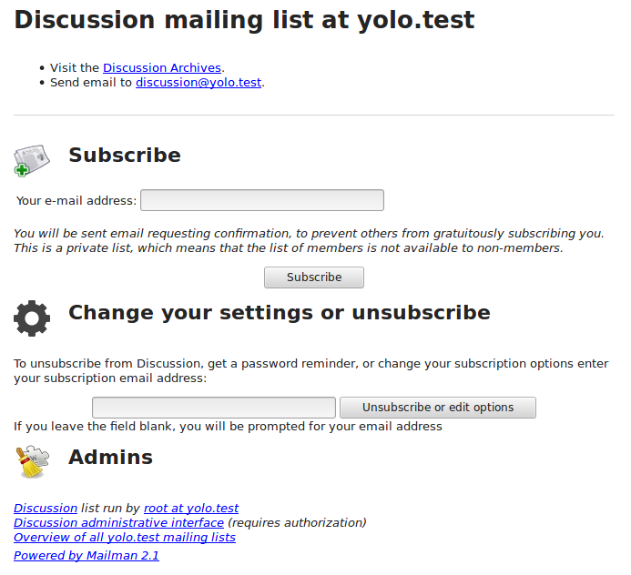

<!--
N.B.: This README was automatically generated by https://github.com/YunoHost/apps/tree/master/tools/README-generator
It shall NOT be edited by hand.
-->

# Mailman for YunoHost

[](https://dash.yunohost.org/appci/app/mailman)    
[](https://install-app.yunohost.org/?app=mailman)

*[Lire ce readme en français.](./README_fr.md)*

> *This package allows you to install Mailman quickly and simply on a YunoHost server.
If you don't have YunoHost, please consult [the guide](https://yunohost.org/#/install) to learn how to install it.*

## Overview

Manage email discussion and e-newsletter lists

**Shipped version:** 2.1.29-1~ynh2


## Screenshots



## Disclaimers / important information

Mailman2 is a deprecated software : it relies on Python 2 which reached end of life in January 2020. Mailman 2 is not being developed anymore, and wont be available on Debian Bullseye / Yunohost 11.x. You should really consider using alternative solutions.

## Documentation and resources

* Official app website: http://www.list.org/
* Official admin documentation: http://www.list.org/docs.html
* Upstream app code repository: https://code.launchpad.net/mailman
* YunoHost documentation for this app: https://yunohost.org/app_mailman
* Report a bug: https://github.com/YunoHost-Apps/mailman_ynh/issues

## Developer info

Please send your pull request to the [testing branch](https://github.com/YunoHost-Apps/mailman_ynh/tree/testing).

To try the testing branch, please proceed like that.
```
sudo yunohost app install https://github.com/YunoHost-Apps/mailman_ynh/tree/testing --debug
or
sudo yunohost app upgrade mailman -u https://github.com/YunoHost-Apps/mailman_ynh/tree/testing --debug
```

**More info regarding app packaging:** https://yunohost.org/packaging_apps